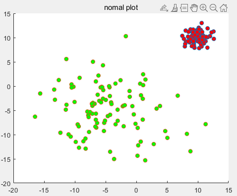
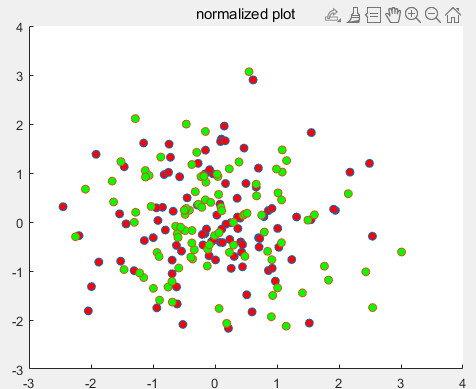
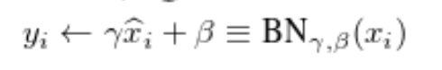
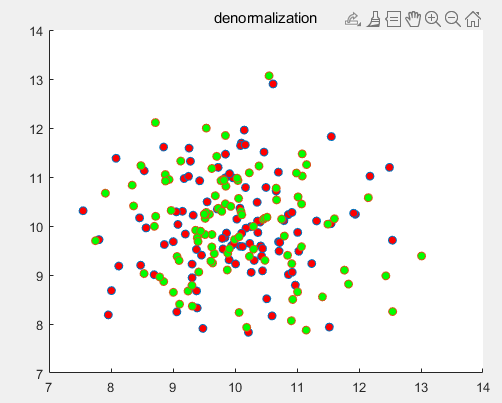
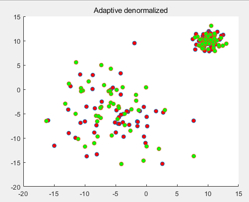

# How to work adaptive de-normalization method?

The concept of adaptive de-normalization is used in a variety of the state-of-the art (e.g., SPADE or styleGAN 1,2). This toy project checked through visualization to see why this works.


```matlab
data_num = 100;
mu1 = 10;
sigma1 = 1;
datas = normrnd(mu1,sigma1,data_num,2);

mu2 = -5;
sigma2 = 5;
datas2 = normrnd(mu2,sigma2,data_num,2);
```

First of all, i prepare a simple data plot like this. 



these data, obtained through random sampling in normal distribution, have different means and variances.



Here, if normalization techniques are applied, the following plot is generated.


Batch normalization scale & shift parameters are as follows.





This way, as you can see, it only changes the scale. In other words, the two distributions are combined!! (as scale = variance, shift = mean normal distribution)


I simply designed adaptive-denormalization method. The following is the adaptive-denormalization code. 

```matlab
de_mean(1:data_num/2,1:2) = mu1;
de_mean(data_num/2+1:data_num,1:2) = mu2;

de_sigma(1:data_num/2, 1:2) = sigma1;
de_sigma(data_num/2+1:data_num,1:2) = sigma2;
```




As you can see, It can be seen that the de-normalization result produces two distributions.


